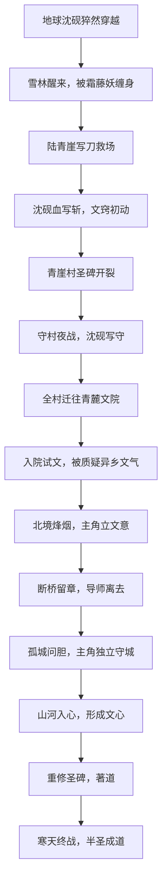
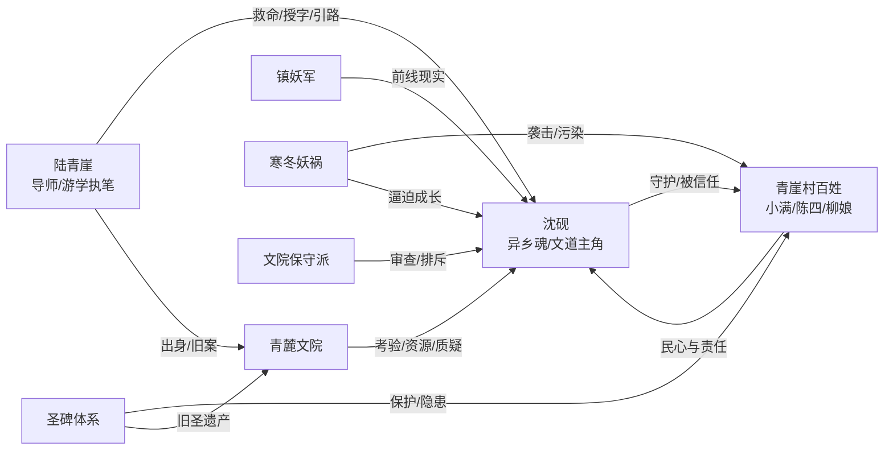
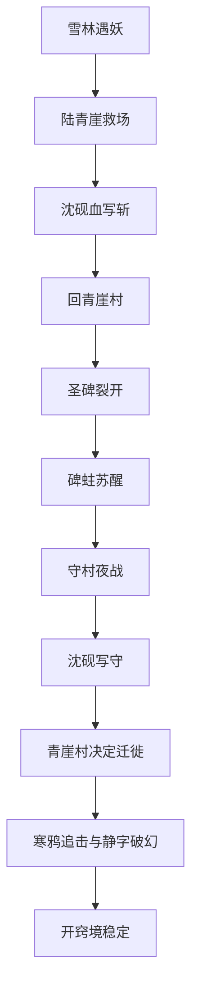
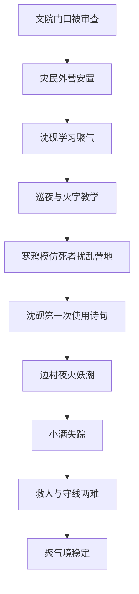
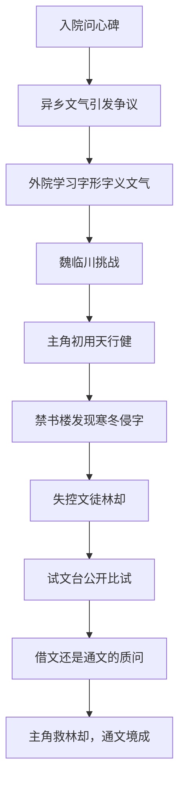

# 《汉字成圣》故事角色组织脉络与总纲 v0.1

## 1. 文档用途

本文档用于把《汉字成圣》的小说主线、主要角色、组织势力和九卷剧情画成整体脉络。

说明：

- 本文档默认“前面一品到三品”按“前期前三卷/前三个成长阶段”处理，即九品开窍境、八品聚气境、七品通文境写细。
- 若后续需要反过来重点写高阶一品到三品，即半圣境、著道境、文心境，可以在本文档基础上再开高阶卷细纲。
- 小说正文独立存放于 `docs/narrative/novel-draft-001.md`。
- 浩然正气线母版存放于 `docs/narrative/haoran-main-story.md`。

## 2. 故事总主线

### 2.1 主线一句话

来自地球的沈砚在寒冬纪元醒来，从一个不会用文气的边境学徒开始，凭汉字、诗文和浩然正气守村、入院、赴边、救城，最终补全崩坏文脉，走到半圣之前。

### 2.2 主角成长线

沈砚的成长不是单纯升级，而是三个问题不断扩大：

| 阶段 | 主角的问题 | 对应剧情表达 |
| --- | --- | --- |
| 活下来 | 字能不能救我？ | 雪林被霜藤妖缠住，第一次血写“斩” |
| 救别人 | 字能不能救人？ | 青崖村守夜，第一次真正写出“守” |
| 被承认 | 借来的诗文算不算自己的力量？ | 入青麓文院，被质疑异端与投机 |
| 立文意 | 我为什么而写？ | 北境烽烟，见战争与难民 |
| 成文章 | 我的文能不能承担后果？ | 断桥留章，导师离去 |
| 生文胆 | 没人带路时还敢不敢守？ | 孤城问胆，独自面对恐惧 |
| 明文心 | 我的道到底是什么？ | 山河入心，拒绝成为工具 |
| 著新道 | 旧圣碑不够用时，能不能补新篇？ | 重修圣碑 |
| 近圣境 | 圣人是力量还是担当？ | 寒天成圣 |

### 2.3 主线流程图



## 3. 核心角色脉络

### 3.1 主角团

| 角色 | 定位 | 首次登场 | 明线功能 | 暗线功能 |
| --- | --- | --- | --- | --- |
| 沈砚 | 主角，地球异乡魂，边境学徒 | 第一章雪林 | 玩家/读者视角，汉字成术的探索者 | 地球文明与异界文脉的连接点 |
| 陆青崖 | 前期导师，青麓文院游学执笔 | 第一章救场 | 教字、讲世界、带主角入门 | 曾参与圣碑体系旧事，离去后留下谜团 |
| 小满 | 青崖村孩童 | 第二章青崖村 | 普通人视角，体现“守护对象” | 后续可成长为文院学生或民心线代表 |
| 陈四 | 断臂猎户 | 第一章雪林 | 边境普通武力代表，敢战但无超凡 | 展示普通人也在守世界 |
| 柳娘 | 青崖村妇人 | 第一章雪林 | 丧亲者、幸存者、民间坚韧 | 后续可成为迁徙队伍中的组织者 |
| 青麓文院同窗甲 | 寒门学生 | 第三卷 | 与主角竞争、合作 | 证明主角不是唯一努力者 |
| 青麓文院同窗乙 | 世家学生 | 第三卷 | 质疑主角，制造冲突 | 代表文院阶层问题 |
| 镇妖军少年校尉 | 军府年轻将领 | 第四卷 | 拉主角进入战场现实 | 与文院路线形成张力 |

### 3.2 反派与敌对角色

| 角色/敌人 | 定位 | 首次登场 | 功能 |
| --- | --- | --- | --- |
| 霜藤妖 | 新手妖物 | 第一章 | 教“斩、静、守”的基础意义 |
| 碑蛀 | 圣碑内部寄生妖邪 | 第二章 | 暴露圣碑体系并不绝对安全 |
| 寒鸦妖群 | 侦查与骚扰妖物 | 第一卷/第二卷 | 教“定、明、风”等功能字 |
| 失控文徒 | 被寒意污染的文院学生 | 第三卷 | 证明文气也会反噬，不是天然正义 |
| 文院保守派 | 人族内部阻力 | 第三卷以后 | 质疑主角来源，维护旧秩序 |
| 妖王前锋 | 中期强敌 | 第七卷 | 推动主角形成文心 |
| 寒天妖主 | 终局敌人 | 第九卷 | 不是单体妖怪，而是寒冬纪元的具象化源头 |

### 3.3 角色关系图



## 4. 组织与势力

### 4.1 承圣国

承圣国是主角醒来所在的人族国度。它没有皇帝，靠文院、军府、圣碑体系和地方自治共同维系。

表面秩序：

- 无皇帝，以“承圣旧约”为最高合法性来源。
- 大城由文院与军府共同维护。
- 边境村镇依靠圣碑残力与本地青壮自保。

潜在矛盾：

- 文院想保文脉，军府想保防线。
- 地方城主想保自己的城。
- 百姓想保命。
- 旧圣遗产正在失效，但谁也不敢轻易承认旧体系不够用了。

### 4.2 青麓文院

边境文院，前期主角入院的主要舞台。

组织功能：

- 培养低品文人。
- 维护附近圣碑。
- 收容有文窍的寒门学子。
- 为边境战线输送文人。

内部派系：

| 派系 | 主张 | 剧情作用 |
| --- | --- | --- |
| 实战派 | 文人应赴边斩妖、守城、救民 | 支持陆青崖和主角 |
| 典籍派 | 文道根基在经典传承，不能乱用新文 | 质疑主角的地球诗文 |
| 保守派 | 圣人遗产不可改，异乡文气有风险 | 后续重要人族阻力 |
| 寒门学生 | 希望靠文道改变命运 | 与主角共鸣 |
| 世家学生 | 拥有资源和旧文脉传承 | 与主角竞争 |

### 4.3 镇妖军

承圣国边境军事力量。士兵未必都有品级，但长期与妖物作战。

剧情功能：

- 把主角从书院带到真正战场。
- 提供拳法、刀道、阵法等非文道角色。
- 展现“会写字”并不等于懂战争。
- 与文院发生资源和决策冲突。

### 4.4 圣碑体系

过往圣人留下的防御网络，也是世界观核心。

明面功能：

- 镇压妖物。
- 守护村镇。
- 稳定文气。
- 记录圣人遗训。

暗线隐患：

- 圣碑依赖人心供养，人心一乱，碑力衰败。
- 有些圣碑内部已被寒意、怨气或妖物寄生。
- 旧圣碑解决的是旧时代问题，无法完全应对寒冬纪元。
- 后期沈砚必须“重修圣碑”，不是推翻圣人，而是补上新时代的答案。

### 4.5 妖族与寒冬势力

前期妖物更像灾害，中后期逐渐显出组织性。

层级草案：

| 层级 | 示例 | 功能 |
| --- | --- | --- |
| 小妖 | 寒鸦妖、霜藤枝妖 | 新手战斗与环境压迫 |
| 入品妖 | 霜藤妖、雪尸将 | 对应低品文人 |
| 寄生妖 | 碑蛀、书蛀、梦蛀 | 攻击文脉和人心 |
| 妖将 | 寒渊战将、妖王前锋 | 中期 Boss |
| 妖王 | 北境妖王 | 大卷 Boss |
| 寒天意志 | 寒天妖主 | 终局敌人 |

## 5. 九卷总纲

### 5.1 九卷总表

| 卷 | 品级 | 境界 | 卷名 | 主舞台 | 核心字/文 | 主要敌人 | 主角成长 |
| --- | --- | --- | --- | --- | --- | --- | --- |
| 1 | 九品 | 开窍境 | 雪林醒魂 | 雪林、青崖村 | 刀、斩、静、定、守 | 霜藤妖、碑蛀 | 从求生到第一次守人 |
| 2 | 八品 | 聚气境 | 边村夜火 | 迁徙路、边村、临时营地 | 火、水、明、风、盾 | 寒鸦妖、雪尸、夜袭妖潮 | 从会写字到会护队 |
| 3 | 七品 | 通文境 | 入院试文 | 青麓文院 | 破、镇、清、醒、疾，第一批诗句 | 失控文徒、魇妖、保守派 | 从借诗到通其精神 |
| 4 | 六品 | 立意境 | 北境烽烟 | 北境前线 | 勇、义、归、阵、止 | 雪尸将、食心妖 | 立下“为民而守”的文意 |
| 5 | 五品 | 成章境 | 断桥留章 | 断桥、撤退线 | 生、桥、断、归、燃 | 霜骨巨妖 | 成章并失去导师 |
| 6 | 四品 | 文胆境 | 孤城问胆 | 孤城 | 胆、诚、醒、照、拒 | 惑心魇、寒梦妖 | 独自守城，文胆成形 |
| 7 | 三品 | 文心境 | 山河入心 | 多城、多战场 | 民、山、河、心、志 | 妖王前锋、腐化文官 | 形成自己的文心 |
| 8 | 二品 | 著道境 | 重修圣碑 | 圣碑网络 | 碑、续、道、衡、正 | 圣碑蛀灵、保守派 | 补旧圣之不足 |
| 9 | 一品 | 半圣境 | 寒天成圣 | 寒天源头 | 圣、春、天、人、正 | 寒天妖主、旧圣残影 | 接近成圣，开新时代 |

## 6. 前期细纲：第一卷 九品开窍境《雪林醒魂》

### 6.1 卷定位

这一卷解决“字能不能救命”。

读者要在第一卷看到：

- 主角穿越后立刻面对死亡。
- 汉字成术的规则第一次出现。
- 导师陆青崖足够有魅力。
- 青崖村百姓不是背景板，而是主角守护理由。
- 圣碑裂开，说明世界并不安全。

### 6.2 主要登场角色

| 角色 | 登场节点 | 与主角关系变化 |
| --- | --- | --- |
| 沈砚 | 雪林开场 | 从求生者变为初开文窍者 |
| 陆青崖 | 雪林救场 | 从救命恩人变为导师 |
| 陈四 | 雪林幸存者 | 从陌生猎户变为普通人勇气代表 |
| 柳娘 | 雪林幸存者 | 从受害者变为守村者 |
| 小满 | 青崖村 | 从被保护的小孩变为“守”的情感锚点 |
| 村老 | 青崖村 | 代表旧村落秩序和对圣碑的依赖 |
| 碑蛀 | 村口圣碑 | 第一卷真正危机源 |

### 6.3 章节拆分建议

| 章 | 标题草案 | 剧情节点 | 爽点/钩子 |
| --- | --- | --- | --- |
| 1 | 霜藤缠身，醒来便是妖口 | 主角醒来被霜藤妖缠住，陆青崖写“刀”救场 | 第一次看见字化为刀 |
| 2 | 一个刀字，半条命 | 主角血写“斩”救人，回村发现圣碑开裂 | 主角第一次成字 |
| 3 | 守字一夜，天亮之前不能退 | 青崖村被妖潮围攻，主角写“守”挡一息 | 弱小主角救下祠堂 |
| 4 | 文窍如灯，灯下有影 | 主角醒来，确认文窍异常，村子决定迁徙 | 地球字库暗线 |
| 5 | 村路三里，步步寒声 | 迁徙准备，村民分歧，有人不愿离乡 | 人心冲突 |
| 6 | 寒鸦过境 | 迁徙队被寒鸦妖侦查，学习“定”“明” | 教学战与小规模群战 |
| 7 | 旧碑回头 | 碑蛀借死者声音追来，主角必须分辨真假 | 静字破幻 |
| 8 | 青崖无妖，碑下有妖 | 揭露圣碑被怨气蛀空，陆青崖曾知类似旧案 | 世界观钩子 |
| 9 | 第一场雪，第一炉火 | 队伍抵达临时营地，主角学会火字雏形 | 生活向缓冲 |
| 10 | 开窍境成 | 小 Boss 战，主角用“刀、斩、静、定、守”组合解决 | 九品开窍境稳定 |

### 6.4 第一卷主线图



### 6.5 第一卷核心冲突

外部冲突：

- 妖物入侵村落。
- 圣碑失效。
- 迁徙路上妖物追击。

内部冲突：

- 沈砚不是本世界的人，他是否真的要替这个村子拼命。
- 村民依赖圣碑多年，突然失去庇护后人心动摇。
- 陆青崖知道更多，但暂时不愿全说。

### 6.6 第一卷结尾

推荐结尾：

迁徙队抵达青麓文院外的接引驿。沈砚本以为终于安全，却发现文院门口正在审查难民。保守派文士看见他身上的异乡文气后，写下一字：

```text
妖
```

那字悬在沈砚头顶，竟没有立刻消散。

第一卷结束钩子：主角救了人，却被怀疑不是人。

## 7. 前期细纲：第二卷 八品聚气境《边村夜火》

### 7.1 卷定位

这一卷解决“文气能不能守住普通人”。

第一卷是活命与开窍，第二卷要让主角开始承担队伍责任。他不只是偶尔爆发，而要稳定使用文气，学会资源、队形、巡夜、防守和安抚人心。

### 7.2 主舞台

青崖村迁徙队没有立刻进入文院核心，而是被安置在青麓文院外围的边村与临时营地。

这个舞台有三个作用：

- 让主角继续和普通百姓绑定，而不是立刻进入学院爽文。
- 给玩家/读者展示灾民、粮食、巡夜、妖潮压力。
- 让沈砚从“写出一个字”成长为“在一夜防线中合理用字”。

### 7.3 新角色

| 角色 | 定位 | 剧情作用 |
| --- | --- | --- |
| 许照微 | 青麓文院外院女学生，实战派 | 负责登记灾民，最早认可沈砚 |
| 魏临川 | 世家学生，典籍派 | 质疑沈砚野路子，形成前期对手 |
| 方伯衡 | 外院教习 | 教沈砚聚气与句槽概念 |
| 周铁衣 | 镇妖军什长 | 代表军府，教主角战场纪律 |
| 魇声寒鸦 | 小 Boss | 会模仿亲人声音扰乱队伍 |

### 7.4 章节拆分建议

| 章 | 标题草案 | 剧情节点 | 爽点/钩子 |
| --- | --- | --- | --- |
| 1 | 文院门前，先问妖身 | 沈砚被“妖”字审查，陆青崖压场 | 主角第一次被人族内部质疑 |
| 2 | 灾民册上无姓名 | 青崖村民被分配到外营，资源紧张 | 组织矛盾 |
| 3 | 聚气第一课 | 方伯衡教聚气，主角发现地球文字会抢文气 | 修炼机制 |
| 4 | 夜火巡营 | 沈砚参与巡夜，学“火、明” | 技能教学 |
| 5 | 寒鸦学人声 | 妖鸦模仿死者声音，引发营地混乱 | 恐怖感与静字应用 |
| 6 | 周铁衣的刀 | 镇妖军什长教主角：战场不等你写完字 | 半即时节奏的叙事化 |
| 7 | 第一句诗 | 主角用一句经典文本稳定人心，但被质疑来源 | 文学系统开端 |
| 8 | 边村夜火 | 妖潮夜袭，营地多点起火 | 群体守护战 |
| 9 | 小满失踪 | 小满被寒鸦诱走，沈砚必须选择救人还是守线 | 道德压力 |
| 10 | 聚气境成 | 主角以“火、守、明、静”组合救回小满并保住营地 | 稳定升境 |

### 7.5 第二卷主线图



### 7.6 第二卷核心冲突

外部冲突：

- 妖物不再只是正面袭击，而是学会模仿、诱导、制造混乱。
- 临时营地防线薄弱，资源不足。

内部冲突：

- 灾民之间争粮、争位置、争被保护的资格。
- 文院学生看不起边村幸存者。
- 镇妖军不信任文人空谈。
- 沈砚第一次意识到救一个人可能会导致另一处防线崩溃。

### 7.7 第二卷结尾

推荐结尾：

边村夜火后，沈砚因救小满而导致另一处粮仓被毁，虽然保住大多数人，却被魏临川指责“妇人之仁”。周铁衣也冷冷告诉他：战场上善良不是错，但善良必须付得起代价。

卷尾，青麓文院正式发出入院试文令。

钩子：沈砚必须进入文院，否则青崖村民得不到长期庇护。

## 8. 前期细纲：第三卷 七品通文境《入院试文》

### 8.1 卷定位

这一卷解决“借来的诗文算不算自己的力量”。

主角来自地球，天然拥有大量异界没有的诗词典籍。这个优势不能只当外挂爽点，必须变成主线矛盾：他能背出名篇，但是否理解其中精神？他用李白、杜甫、论语、周易的句子，算不算偷？世界承认的是文本，还是文本背后的人心？

### 8.2 主舞台

青麓文院。

文院分为：

- 外院：低品文人学习、杂役、灾民子弟。
- 讲经堂：典籍课、字义课、文气课。
- 试文台：入院考核、辩文、公开比试。
- 碑廊：文院维护的小型圣碑群。
- 禁书楼：保存被污染、残缺或争议文献。

### 8.3 新角色

| 角色 | 定位 | 剧情作用 |
| --- | --- | --- |
| 许照微 | 实战派学生 | 成为主角早期同伴，认可其守人之心 |
| 魏临川 | 世家学生 | 前期对手，代表“正统文脉”质疑 |
| 方伯衡 | 外院教习 | 温和但谨慎，愿教主角规则 |
| 韩若拙 | 典籍派老先生 | 坚持文字出处与传承合法性 |
| 秦问碑 | 保守派执事 | 怀疑主角为妖祟或碑外异端 |
| 失控文徒林却 | 被寒意污染的学生 | 以悲剧证明文道也会伤人 |

### 8.4 章节拆分建议

| 章 | 标题草案 | 剧情节点 | 爽点/钩子 |
| --- | --- | --- | --- |
| 1 | 入院先验心 | 沈砚被要求在问心碑前写字 | 异乡文气引发碑鸣 |
| 2 | 字有出处 | 韩若拙追问主角诗文来源 | 文化外挂第一次被拷问 |
| 3 | 外院三课 | 字形、字义、文气运转三门课 | 系统化补设定 |
| 4 | 世家子的繁体字 | 魏临川用繁体模板压制主角 | 简繁体差异进入剧情 |
| 5 | 第一句通文 | 主角理解“天行健”不是口号，而是逆境自强 | 诗文技能觉醒 |
| 6 | 禁书楼的寒页 | 主角接触被污染典籍，发现寒冬侵蚀文字 | 暗线升级 |
| 7 | 林却失控 | 失控文徒用错字成术，伤及学生 | 文道风险 |
| 8 | 试文台 | 主角与魏临川公开比试 | 学院爽点 |
| 9 | 借文还是通文 | 主角被迫说明自己为何能写出异界未见诗句 | 核心质问 |
| 10 | 通文境成 | 主角用诗文救下失控林却，证明自己不是只借字杀人 | 升境与认可 |

### 8.5 第三卷主线图



### 8.6 第三卷核心冲突

外部冲突：

- 文院审查主角。
- 失控文徒造成危机。
- 禁书楼寒页暗示文脉正在被污染。

内部冲突：

- 主角使用地球诗文，是否只是拿前人成果装成自己的力量。
- 正统文院是否有资格判定“未见过的经典”为异端。
- 魏临川的质疑并非全错，他逼主角从背诵走向理解。

### 8.7 第三卷结尾

推荐结尾：

沈砚通过试文，获得青麓文院外院身份。但秦问碑没有放弃审查，他把沈砚的名字写入“异文册”。与此同时，北境传来急报：镇妖军防线失守，文院必须派学生随军赴边。

卷尾钩子：

沈砚刚刚被文院承认，就要离开课堂，去真正的战场验证自己的文。

## 9. 后续六卷草稿

### 9.1 第四卷 六品立意境《北境烽烟》

主舞台：北境前线、难民长路、镇妖军营。

核心内容：

- 沈砚第一次面对成规模战争。
- 文院和军府围绕“救难民还是守关口”争执。
- 沈砚发现每一次选择都不完美。
- 他不再只问怎么赢，而是问自己为什么而写。

关键节点草稿：

- 镇妖军校尉周铁衣带主角上墙。
- 沈砚用诗文稳住溃兵。
- 难民队伍中出现妖化者。
- 主角立下第一道文意：我之文，不为自证，只为此地仍有人敢守。

### 9.2 第五卷 五品成章境《断桥留章》

主舞台：断桥、撤退线、寒渊裂口。

核心内容：

- 主角学习文章段落技能。
- 妖潮截断退路，大量百姓被困。
- 陆青崖写尽最后一篇残章，保住撤退线。
- 导师离去，主角真正成人。

关键节点草稿：

- 主角第一次尝试写完整战场檄文失败。
- 陆青崖展示成章境真正力量。
- 断桥一战，陆青崖失踪或牺牲。
- 主角继承导师之笔。

### 9.3 第六卷 四品文胆境《孤城问胆》

主舞台：被围孤城、幻境城墙、断粮内城。

核心内容：

- 导师离去后，主角精神动摇。
- 妖物不急攻城，而是用幻境、人心、谣言瓦解防线。
- 主角在无人兜底的情况下守住一城。
- 文胆成形。

关键节点草稿：

- 幻境中陆青崖质问主角。
- 城内投降派、逃亡派、死守派争斗。
- 主角写“胆、诚、照、拒”破幻。
- 卷尾主角承认害怕，但不退。

### 9.4 第七卷 三品文心境《山河入心》

主舞台：多座边城、旧战场、文院与军府高层。

核心内容：

- 主角成为各方争夺对象。
- 文院想让他成为招牌，军府想让他成为兵器。
- 主角回看前面救过的人，确认自己的文心。
- 形成“山河入心，万民在文”的路线。

关键节点草稿：

- 小满进入文院，代表被主角影响的新一代。
- 魏临川从对手转为复杂盟友。
- 腐化文官试图把灾民当诱饵。
- 主角拒绝成为任何一方工具，文心成。

### 9.5 第八卷 二品著道境《重修圣碑》

主舞台：圣碑廊、旧圣遗迹、承圣国中枢。

核心内容：

- 圣碑体系大面积失效。
- 沈砚发现旧圣碑无法回答寒冬纪元的新问题。
- 保守派反对修改圣碑。
- 主角不是毁圣，而是续圣。

关键节点草稿：

- 旧圣残文与地球经典发生共鸣。
- 主角开始接触后期律法分支。
- 圣碑司内部有人想牺牲边境保中枢。
- 沈砚完成新碑初稿，天地承认其著道资格。

### 9.6 第九卷 一品半圣境《寒天成圣》

主舞台：寒天源头、崩坏圣碑网络、终局战场。

核心内容：

- 寒冬纪元真相揭开：它是妖祸、人心、旧秩序失效共同积累的结果。
- 旧圣残影出现，有的帮主角，有的阻主角。
- 终战不只是杀死寒天妖主，而是让世界重新承认“人心可暖”。
- 主角抵达半圣境，但不把文道据为己有。

关键节点草稿：

- 陆青崖残章回响。
- 主角一路写过的字和救过的人形成终局回声。
- 最后一字可定为“春”“人”或“正”，待确认。
- 真结局：人人可拾字，人人可守心。

## 10. 三条暗线

### 10.1 异乡文气暗线

沈砚的地球字库不是简单外挂。

推进方式：

- 第一卷：陆青崖发现他的字“不像本地书塾”。
- 第二卷：主角使用地球诗文，引起文气异常。
- 第三卷：问心碑无法判定其来源。
- 中期：文院怀疑他是“碑外异文”。
- 后期：证明地球文明不是污染，而是另一条可被此界承认的文脉。

### 10.2 圣碑失效暗线

圣碑不是无敌保护罩，而是旧时代答案。

推进方式：

- 第一卷：青崖村小碑被碑蛀寄生。
- 第三卷：文院碑廊出现寒页污染。
- 第五卷：圣碑阵线无法保护断桥。
- 第八卷：圣碑体系全面失效，逼主角著道。

### 10.3 导师旧事暗线

陆青崖不是单纯新手导师。

推进方式：

- 第一卷：他似乎知道碑蛀，但不细说。
- 第二卷：文院有人对他态度复杂。
- 第三卷：保守派提起他当年某次“越权改碑”。
- 第五卷：导师离去时补上自己未完成的旧债。
- 第九卷：导师残章回响，成为终局一部分。

## 11. 后续待确认

1. 你说的“前面一品到三品”是否就是我这里处理的前三卷；如果你指的是高阶一品到三品，我再补一版高阶详细纲。
2. 主角沈砚这个名字是否保留。
3. 导师陆青崖这个名字是否保留。
4. 青麓文院、承圣国、镇妖军这些暂定名是否需要改得更有网文辨识度。
5. 导师离去最终选“牺牲、失踪、背罪离队、被高层带走”哪一种。
