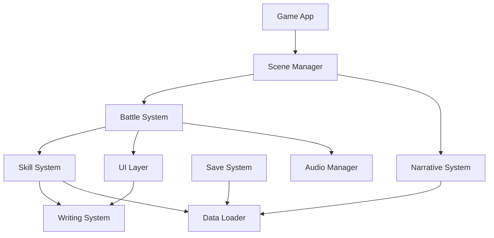
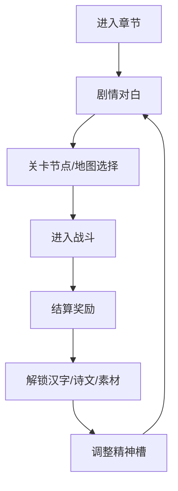
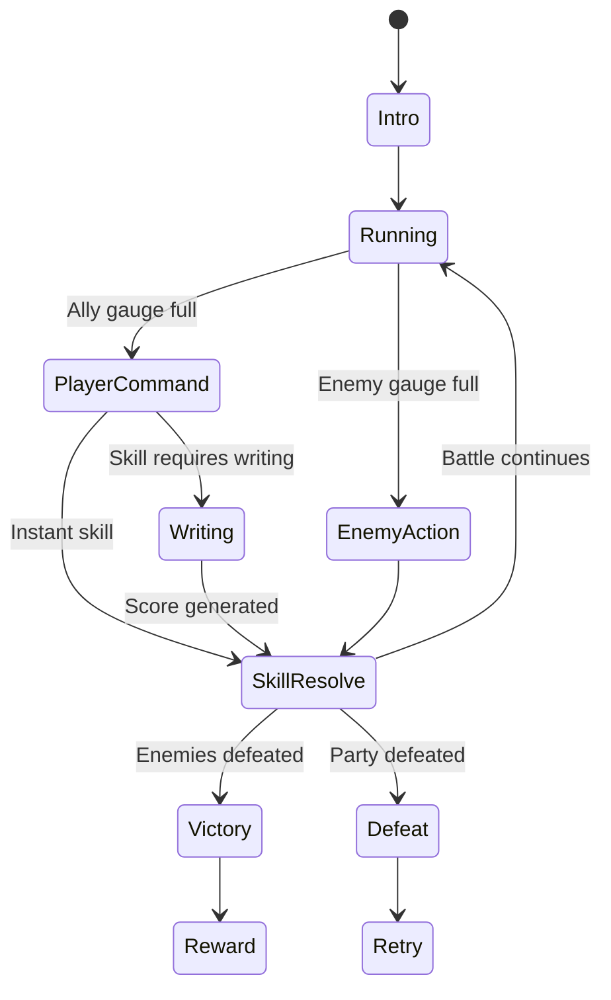
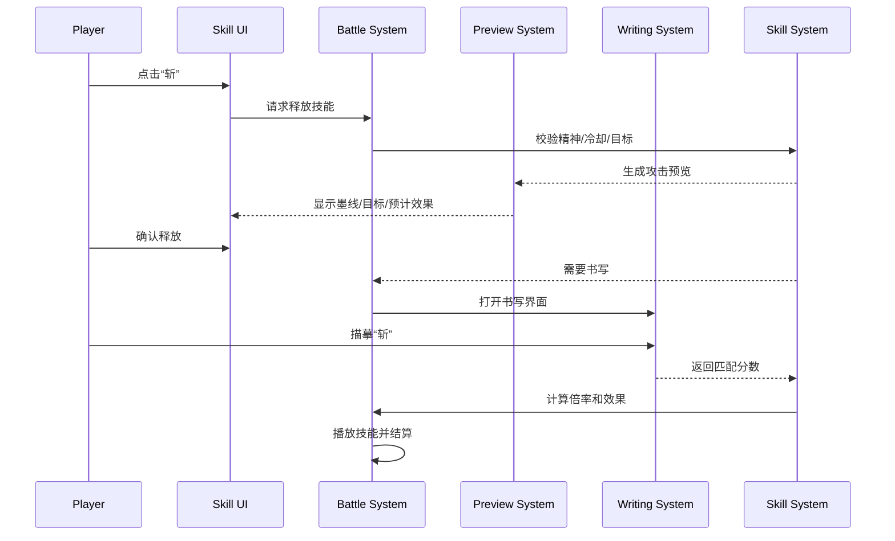

# 《汉字成圣》系统设计文档 v0.1

## 1. 文档目标

本文档用于定义《汉字成圣》的游戏系统、交互模式、前端架构、数据结构和 MVP 实现方案。

当前目标不是一次性设计完整商业版本，而是把第一版网页原型的核心体验跑通：

- 2D 横版半即时战斗。
- 小人角色与妖物对战。
- 玩家通过选择、输入、书写汉字释放技能。
- 书写质量影响技能效果。
- 诗文技能作为高阶释放形式。
- 剧情、关卡、汉字、诗文数据可持续扩展。

## 2. 设计原则

### 2.1 先爽，再深

前期交互必须让玩家快速感受到“写字真的有力量”。低品级、新手期的书写判定要宽松，战斗反馈要强，不能一开始就把玩家卡在练字精度上。

后期再逐步引入：

- 繁体模板。
- 隐藏底板。
- 名家书法。
- 草书识别。
- 更严格的笔画与结构评分。

### 2.2 战斗轻量，文字厚重

横版战斗表现保持轻量：小人、碰撞、击退、简单动作、镜头震动、文字特效。真正的差异化来自文字系统，不来自复杂动作游戏操作。

玩家的主要决策是：

- 此时该用哪个字。
- 是否冒险手写强化。
- 是否消耗精神释放诗文。
- 是否保留技能应对下一波敌人。

MVP 美术策略：

- 背景可以有较完整的氛围绘制，用少量静态图撑住世界观。
- 角色、导师、怪物优先使用火柴人、剪影和简化部件。
- 动作只做待机、施法、受击、击退、倒地等少量关键状态。
- 精美立绘、复杂怪物骨骼、角色表情差分留到后期。
- `汉字成圣` Logo 只在初始界面展示，战斗和书写界面不常驻 Logo。

### 2.3 数据驱动

汉字、诗文、敌人、关卡、剧情节点都要以数据形式维护。后期 500 字技能库不应写死在代码中。

### 2.4 MVP 不做过度智能

书写识别 MVP 采用底板 mask 匹配，不做机器学习识别。自然语言律法、自由诗文生成、复杂书法鉴赏都放到后期。

## 3. 平台与技术方案

### 3.1 目标平台

- 首发：桌面网页浏览器。
- 次级适配：移动端浏览器触控。
- 部署：静态站点即可运行 MVP。

### 3.2 推荐技术栈

| 层级 | 技术 | 用途 |
| --- | --- | --- |
| 游戏引擎 | Phaser 3 | 2D 场景、角色、碰撞、动画、镜头 |
| 语言 | TypeScript | 类型安全、数据结构清晰 |
| UI 层 | HTML/CSS 或 Phaser UI 混合 | 技能栏、行动条、弹窗、剧情文本 |
| 书写层 | Canvas 2D | 捕获鼠标/触控轨迹，绘制底板和玩家笔迹 |
| 数据 | JSON | 汉字、诗文、敌人、关卡、剧情 |
| 存档 | LocalStorage/IndexedDB | MVP 本地进度 |
| 后端 | 暂不需要 | 后期账号、云存档、排行榜、玩家字迹库 |

### 3.3 为什么选 Phaser

- 横版战斗、动画、碰撞、粒子和镜头都能快速实现。
- Web 部署成本低。
- 书写 Canvas 可以作为 DOM Overlay 叠在 Phaser 画布之上。
- 后续可逐步替换美术资源，不影响底层战斗循环。

## 4. 总体架构

### 4.1 客户端模块图



### 4.2 模块职责

| 模块 | 职责 |
| --- | --- |
| App | 初始化游戏、加载配置、挂载画布 |
| Scene Manager | 管理标题页、剧情页、战斗页、结算页、字库页 |
| Battle System | 行动条、回合窗口、敌我状态、伤害结算 |
| Skill System | 汉字技能、诗文技能、冷却、消耗、倍率 |
| Writing System | 底板显示、笔迹采集、匹配评分、结果输出 |
| Narrative System | 剧情文本、对白、选择、章节进度 |
| Data Loader | 加载 JSON 数据，校验基础字段 |
| Save System | 保存解锁字、熟练度、章节进度、设置 |
| UI Layer | 技能栏、行动条、状态、弹窗、书写界面 |
| Audio Manager | 音效、环境音、技能音 |

## 5. 核心交互模式

### 5.1 主流程



MVP 可简化为：

```text
标题页 -> 序章剧情 -> 教学战 1 -> 剧情 -> 教学战 2 -> Boss 战 -> 结算
```

### 5.2 战斗屏幕布局

桌面端推荐布局：

```text
┌─────────────────────────────────────────────┐
│ 章节名/关卡目标                  设置/暂停 │
├─────────────────────────────────────────────┤
│                                             │
│    我方小人                         敌方妖物 │
│   HP/精神/状态                    HP/蓄力/状态│
│                                             │
│          文字特效、碰撞、技能演出区域          │
│                                             │
├─────────────────────────────────────────────┤
│ 左侧角色头像 + HP/精神/状态图标             │
│ 中央大字技能卡：刀 斩 静 定                 │
│ 右侧信息框：技能说明/攻击预览/战斗提示       │
└─────────────────────────────────────────────┘
```

底部 HUD 采用第一版方案：

- 左侧显示主角、导师头像或剪影头像，以及 HP、精神、状态图标。
- 中央显示大汉字技能卡，选中技能有金色描边和发光。
- 右侧保留信息框，用于技能说明、攻击预览和战斗提示。
- `汉字成圣` Logo 不在战斗界面展示。

移动端后续布局：

- 战斗画面上半屏。
- 技能与行动条下半屏。
- 书写时全屏覆盖。

### 5.3 玩家输入

| 场景 | 输入 |
| --- | --- |
| 剧情对白 | 鼠标点击、空格、Enter |
| 战斗选择 | 鼠标点击技能、数字键快捷键 |
| 书写 | 鼠标拖拽、触控拖拽 |
| 新字输入 | 键盘输入汉字 |
| 暂停/设置 | Esc |
| 加速剧情 | 长按或点击跳过，MVP 可暂不做 |

## 6. 半即时行动条战斗系统

### 6.1 战斗节奏

角色拥有行动值 `actionGauge`，随时间增长。

```text
actionGauge += speed * deltaTime * modifiers
```

当行动值达到 `100`：

- 我方角色：进入指令窗口，战斗时间减速或暂停。
- 敌方角色：根据 AI 选择技能并释放。

我方指令完成后：

- 行动值清零或扣除固定值。
- 技能可能附加行动延迟。
- 部分技能可击退敌方行动条。

### 6.2 时间控制

MVP 推荐：

- 平时战斗正常流动。
- 我方行动条满时，时间暂停，玩家选择技能。
- 进入书写界面时，战斗完全暂停。
- 书写结束后回到战斗，播放技能演出。

后期可改为：

- 行动条满时只减速，不完全暂停。
- 高难度战斗中书写有时间限制。

### 6.3 战斗状态机



### 6.4 基础战斗公式

MVP 可使用简单公式：

```text
finalPower = basePower * writingMultiplier * affinityMultiplier * buffMultiplier
damage = max(1, finalPower - target.defense)
```

状态技能：

```text
statusChance = baseChance * writingMultiplier * resistanceModifier
```

行动条击退：

```text
gaugeKnockback = baseKnockback * writingMultiplier
```

### 6.5 资源

| 资源 | 说明 |
| --- | --- |
| HP | 生命值，归零失败或倒地 |
| Spirit | 精神值，释放字与诗文消耗 |
| Action Gauge | 行动条，决定出手窗口 |
| Ink/Mediator | 媒介资源，MVP 可暂不做消耗 |
| Skill Cooldown | 技能冷却，防止反复用同一个字 |

MVP 建议只做：

- HP。
- Spirit。
- Action Gauge。
- Cooldown。

## 7. 汉字技能系统

### 7.1 技能类型

| 类型 | 示例字 | 效果 |
| --- | --- | --- |
| 攻击 | 刀、斩、火 | 造成伤害 |
| 控制 | 定、镇、止 | 停止行动条、减速、打断 |
| 防御 | 守、盾 | 护盾、减伤 |
| 净化 | 静、清、醒 | 解除恐惧、混乱、污染 |
| 增益 | 勇、明 | 提升攻击、命中、看破弱点 |
| 位移 | 风、归 | 推开、拉回、调整站位 |
| 场地 | 阵、桥 | 改变战场区域 |
| 规则 | 己、禁、律等 | 后期律法分支，MVP 不做 |

### 7.2 技能释放流程



攻击预览规则：

- 预览只展示预计目标、轨迹、范围和克制信息，不扣资源。
- 单体攻击显示墨线或箭头，范围技能显示影响区域。
- 控制技能高亮目标行动条，防御技能高亮保护对象。
- 玩家确认后才进入书写或直接释放。
- 如果玩家取消，返回技能选择状态。

### 7.3 技能熟练度

每个字有熟练度：

- 使用次数。
- 平均书写评分。
- 首次剧情理解。
- 是否掌握繁体/变体。

熟练度影响：

- 低熟练：每次释放都要手写。
- 中熟练：普通释放可跳过手写，但手写可强化。
- 高熟练：冷却降低、基础倍率提高、可解锁变体。

MVP 简化：

- 教学字每次释放都进入书写，体现核心玩法。
- Boss 战可允许熟练字直接释放，关键字必须手写。

### 7.4 精神槽

玩家战斗前选择装备字：

- MVP：固定技能槽，不做自由构筑。
- 第一章后：解锁战前配置界面。

技能槽信息：

```json
{
  "singleCharSlots": ["dao", "zhan", "jing", "ding"],
  "literarySlots": [],
  "lawSlots": []
}
```

## 8. 书写交互系统

### 8.1 书写界面

书写界面是全屏或半屏覆盖层：

```text
┌────────────────────────────┐
│  写下：斩                  │
│  剩余时间：∞ / 后期倒计时  │
├────────────────────────────┤
│                            │
│      淡色底板：斩           │
│      玩家墨迹轨迹           │
│                            │
├────────────────────────────┤
│ 重写        确认释放        │
└────────────────────────────┘
```

### 8.2 MVP 评分方式

采用 Canvas mask 像素匹配：

1. 底板字形渲染到离屏 Canvas，生成 `targetMask`。
2. 玩家笔迹渲染到同尺寸离屏 Canvas，生成 `strokeMask`。
3. 计算覆盖、越界和空缺。
4. 输出 `score`。

基础指标：

```text
coverage = overlapPixels / targetPixels
overflow = outsidePixels / strokePixels
missing = 1 - coverage
score = coverage * 0.75 + (1 - overflow) * 0.25
```

前期宽松：

```text
writingMultiplier = clamp(0.5 + score * 0.6, 0.5, 1.1)
```

后期硬核：

```text
writingMultiplier = clamp(0.2 + score * 1.2, 0.2, 1.4)
```

### 8.3 底板来源

MVP 底板：

- 使用系统字体渲染楷体风格汉字。
- 若系统字体不可控，打包字体文件。
- 先支持简体。

后续：

- 每个字提供 SVG path。
- 支持繁体底板。
- 支持名家书法图片 mask。
- 支持隐藏底板模式。

### 8.4 笔迹数据

记录玩家每次书写：

```json
{
  "char": "斩",
  "strokes": [
    {
      "points": [
        { "x": 102, "y": 88, "t": 0 },
        { "x": 110, "y": 93, "t": 16 }
      ]
    }
  ],
  "score": 0.82,
  "durationMs": 1480
}
```

MVP 不上传，仅用于本地评分和熟练度统计。

## 9. 诗文技能系统

### 9.1 释放方式

诗文技能不要求逐字手写。

流程：

1. 玩家选择已解锁诗文。
2. UI 展示文本。
3. 玩家确认释放。
4. 系统要求手写关键字，或允许跳过。
5. 手写关键字则获得更高倍率和更强演出。

示例：

```text
三军可夺帅也，匹夫不可夺志也
关键字：志
```

### 9.2 匹配方式

MVP：

- 诗文不做自由输入。
- 只从已解锁列表中选择。
- 关键字使用书写系统评分。

后续：

- 玩家可键盘输入句子。
- 使用字符串相似度匹配素材库。
- 匹配达到 90% 后临时释放或解锁。

### 9.3 技能类型

| 类型 | 示例 | 效果 |
| --- | --- | --- |
| 豪迈 | 长风破浪会有时 | 解控、加速、爆发 |
| 忧民 | 安得广厦千万间 | 群体护盾 |
| 明志 | 三军可夺帅也 | 抗恐惧、抗动摇 |
| 劝学 | 苟日新，日日新 | 刷新低阶技能 |
| 山河 | 大风起兮云飞扬 | 群体击退 |

## 10. 剧情与关卡系统

### 10.1 剧情节点

剧情采用节点式数据：

```json
{
  "id": "prologue_001",
  "type": "dialogue",
  "background": "snow_forest",
  "lines": [
    {
      "speaker": "沈砚",
      "text": "我在哪？"
    },
    {
      "speaker": "陆青崖",
      "text": "醒了？醒了就别死。"
    }
  ],
  "next": "battle_frost_vine_01"
}
```

### 10.2 关卡节点

```json
{
  "id": "battle_frost_vine_01",
  "type": "battle",
  "scene": "snow_forest",
  "party": ["shen_yan", "lu_qingya"],
  "enemies": ["frost_vine"],
  "objectives": ["survive", "learn_zhan"],
  "rewards": {
    "unlockChars": ["zhan", "jing"],
    "storyFlags": ["opened_wenqiao"]
  },
  "next": "story_qingya_village_01"
}
```

### 10.3 第一版 MVP 关卡

| 关卡 | 类型 | 目标 | 解锁 |
| --- | --- | --- | --- |
| 雪林醒来 | 剧情 + 教学战 | 看见陆青崖写“刀”，主角血写“斩” | 斩 |
| 回村路 | 小战斗 | 学“定”，打断寒鸦 | 定 |
| 青崖村守夜 | 群体守护战 | 用“静”“守”保护祠堂 | 静、守 |
| 圣碑裂痕 | Boss 战 | 击退碑蛀和霜藤主根 | 第一章完成 |

## 11. UI 系统

### 11.1 核心 UI

| UI | 功能 |
| --- | --- |
| 标题页 | 开始、继续、设置 |
| 剧情对话框 | 角色名、文本、头像/立绘可后续 |
| 战斗 HUD | HP、精神、行动条、状态 |
| 技能栏 | 单字技能、诗文技能、道具 |
| 书写界面 | 底板、笔迹、重写、确认 |
| 结算页 | 经验、解锁、评分 |
| 字库页 | 查看已解锁字、熟练度、说明 |
| 设置页 | 音量、文字速度、书写灵敏度 |

### 11.2 交互优先级

MVP 必做：

- 战斗 HUD。
- 技能栏。
- 书写界面。
- 剧情对话框。
- 战斗结算。

第一版可暂缓：

- 完整字库页。
- 技能构筑页。
- 设置细项。
- 成就与收藏。

## 12. 数据结构草案

### 12.1 Character

```ts
type Character = {
  id: string;
  name: string;
  faction: "player" | "ally" | "enemy";
  maxHp: number;
  hp: number;
  maxSpirit: number;
  spirit: number;
  speed: number;
  defense: number;
  skills: string[];
  states: StatusEffect[];
};
```

### 12.2 HanziSkill

```ts
type HanziSkill = {
  id: string;
  char: string;
  variants: string[];
  skillName: string;
  type: SkillType[];
  basePower: number;
  spiritCost: number;
  cooldown: number;
  target: "enemy" | "ally" | "self" | "allEnemies" | "allAllies";
  tags: string[];
  requiresWriting: boolean;
  unlockChapter: string;
  visualKey: string;
  cultureNote: string;
};
```

### 12.3 LiterarySkill

```ts
type LiterarySkill = {
  id: string;
  text: string;
  source: string;
  skillName: string;
  category: string[];
  spiritCost: number;
  cooldown: number;
  keyWrittenChar: string;
  effectKey: string;
  unlockChapter: string;
  cultureNote: string;
};
```

### 12.4 Enemy

```ts
type Enemy = {
  id: string;
  name: string;
  maxHp: number;
  speed: number;
  defense: number;
  aiProfile: string;
  skills: string[];
  weaknesses: string[];
  resistances: string[];
};
```

### 12.5 SaveData

```ts
type SaveData = {
  version: number;
  currentChapter: string;
  unlockedChars: string[];
  unlockedLiterarySkills: string[];
  charMastery: Record<string, {
    uses: number;
    bestScore: number;
    averageScore: number;
  }>;
  storyFlags: Record<string, boolean>;
  settings: {
    textSpeed: number;
    bgmVolume: number;
    sfxVolume: number;
  };
};
```

## 13. 内容资产目录建议

未来代码目录可参考：

```text
src/
  game/
    scenes/
    battle/
    writing/
    skills/
    narrative/
    ui/
    save/
  data/
    characters.json
    enemies.json
    hanzi-skills.json
    literary-skills.json
    chapters.json
    dialogue/
  assets/
    sprites/
    backgrounds/
    audio/
    fonts/
```

当前文档资产：

```text
docs/
  game-design-document.md
  content/
    hanzi-skill-catalog.md
    literary-skill-catalog.md
  narrative/
    haoran-main-story.md
    story-map-and-factions.md
    novel-draft-001.md
  system/
    system-design.md
```

## 14. MVP 实现拆分

### 14.1 里程碑 1：可运行战斗壳

目标：

- Phaser 项目跑起来。
- 左右双方小人显示。
- 行动条增长。
- 点击技能造成伤害。
- 战斗胜负结算。

不做：

- 书写评分。
- 剧情系统。
- 完整美术。

### 14.2 里程碑 2：书写释放技能

目标：

- 点击“斩”打开书写界面。
- 显示底板字。
- 鼠标描摹。
- Canvas mask 评分。
- 评分影响伤害。

### 14.3 里程碑 3：序章可玩

目标：

- 加入剧情对白。
- 雪林教学战。
- 回村路小战斗。
- 青崖村守夜战。
- 第一章 Boss 战。

### 14.4 里程碑 4：内容数据化

目标：

- 汉字技能从 JSON 加载。
- 敌人从 JSON 加载。
- 关卡从 JSON 加载。
- 存档记录已解锁字与剧情进度。

### 14.5 里程碑 5：网页部署

目标：

- 打包静态站点。
- 部署到服务器。
- 可通过 URL 试玩。
- 兼容主流桌面浏览器。

## 15. 风险与解决方案

### 15.1 书写识别不准

风险：

- 玩家觉得自己写对了，但系统给低分。
- 字体底板与玩家习惯差距太大。

方案：

- 前期评分宽松。
- 显示覆盖反馈。
- 提供“重写”按钮。
- 主线低分也能释放，只是效果降低。

### 15.2 战斗节奏拖慢

风险：

- 每个技能都要手写，战斗变慢。

方案：

- 只有关键技能、新字、强化释放需要手写。
- 熟练字可以直接释放。
- 小怪战减少书写次数，Boss 战强调书写。

### 15.3 500 字技能库维护成本高

风险：

- 每个字都要写效果、数值、底板、说明，工作量巨大。

方案：

- 先做 30 字。
- 再扩 100 字。
- 数据字段统一。
- 多数字可共享效果模板。

### 15.4 诗文内容版权与准确性

风险：

- 现代文本有版权。
- 典故解释错误。

方案：

- 优先公版古典文本。
- 给每条诗文记录来源。
- 现代内容只做玩家自定义或非核心技能，谨慎处理。

### 15.5 手机端书写体验

风险：

- 小屏幕写复杂汉字困难。

方案：

- 首发桌面端。
- 移动端加大书写区域。
- 简化复杂字。
- 提供触控灵敏度设置。

## 16. 后期系统预留

### 16.1 律法分支

后期新增：

- 规则模板。
- 条件触发。
- 场地约束。
- 现代法律/戒律/契约精神技能。

MVP 不做，只埋剧情伏笔。

### 16.2 名家书法

后期新增：

- 隐藏底板。
- 名家字形 mask。
- 高匹配识别。
- 书法故事与倍率奖励。

### 16.3 玩家字迹库

后期可记录：

- 玩家最常用字。
- 最高评分字。
- 个人书写风格。
- 挑战关排行榜。

需要后端时再设计上传与隐私策略。

## 17. 待确认问题

1. MVP 是否确定使用 Phaser + TypeScript。
2. 战斗中我方行动条满时，是完全暂停还是大幅减速。
3. 序章是否强制每次技能都手写，还是只手写关键字。
4. 书写时是否有倒计时。建议前期无倒计时，后期挑战再加。
5. 是否需要第一版就做移动端触控适配。
6. 第一版是否做技能构筑页，还是固定技能槽。
7. 第一版部署是否只做静态站点，不做账号与后端。
