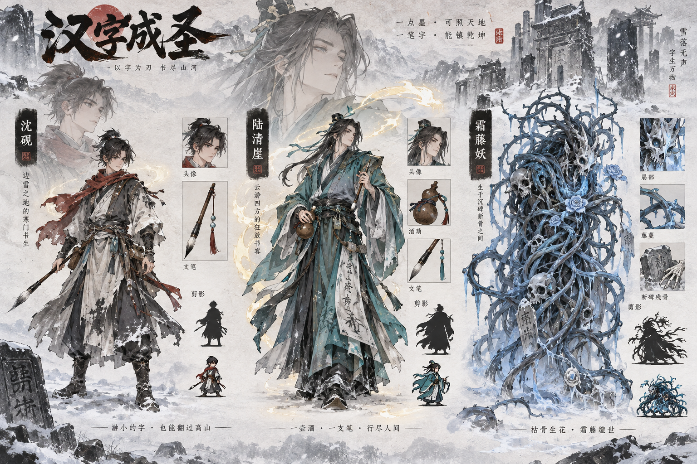
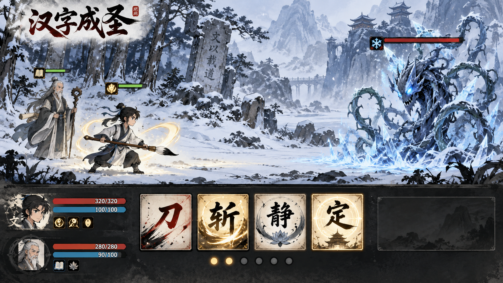
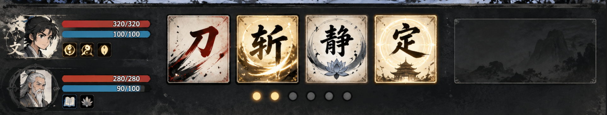
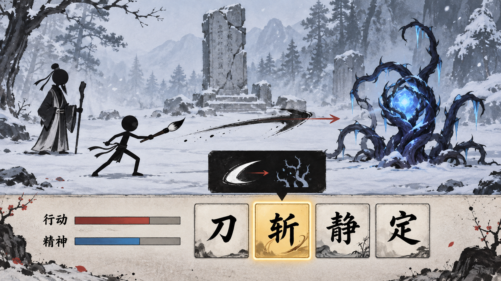
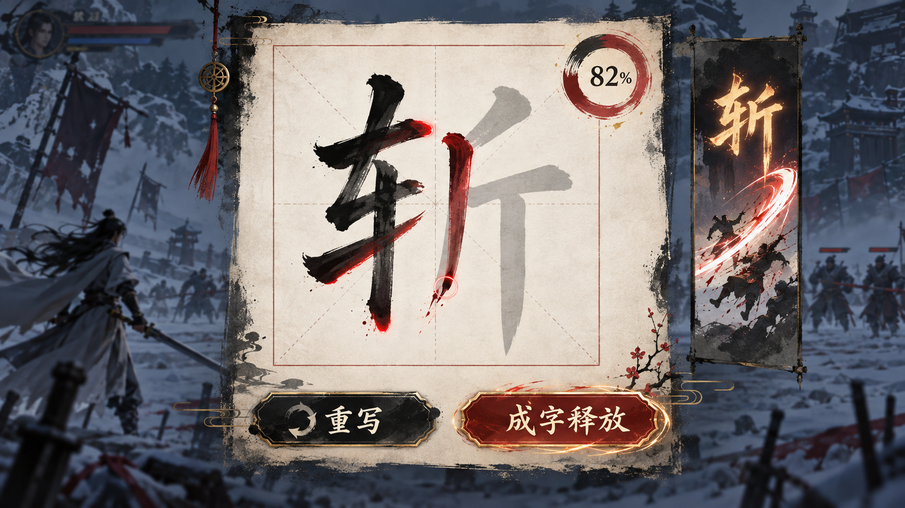
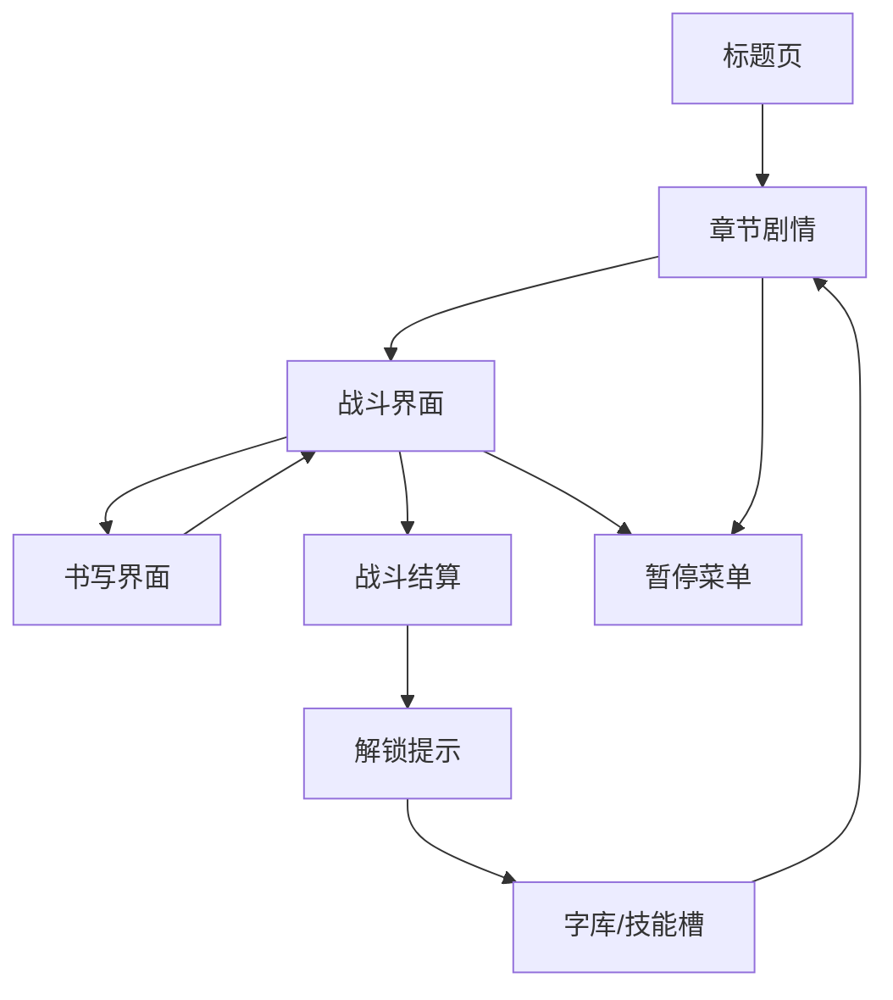

# 《汉字成圣》界面设计稿方案 v0.1

## 1. 文档目标

本文档用于描述《汉字成圣》第一版网页端的低保真界面方案。它不是最终美术稿，而是用于确认：

- 玩家进入游戏后看到什么。
- 战斗时怎么选择技能。
- 书写汉字的界面如何出现。
- 剧情、战斗、结算、字库之间如何流转。
- 前端 MVP 应优先实现哪些界面。

## 2. 视觉方向

### 2.1 关键词

- 水墨。
- 寒冬。
- 纸纹。
- 朱印。
- 文气。
- 火柴人/小人横版战斗。

### 2.2 主色建议

| 用途 | 颜色方向 | 说明 |
| --- | --- | --- |
| 背景 | 雪灰、墨黑、淡纸白 | 保持寒冬纪元氛围 |
| 主要强调 | 朱砂红 | 用于确认、命中、印章、关键字 |
| 文气 | 淡金、暖白 | 用于主角技能、正向状态 |
| 妖气 | 寒青、霜蓝、暗紫 | 用于妖物、寒蚀、负面状态 |
| UI 线条 | 深墨、半透明黑 | 避免界面过亮 |

### 2.3 字体与质感

MVP 可先用系统字体，后续建议：

- 标题：偏书法感的中文标题字体。
- 正文：清晰可读的宋体/屏显宋体。
- 数值/UI：现代黑体，保证小字号清晰。
- 战斗飞字：用更有笔锋的字形。

界面整体不要做太重的仿古拟物。重点是“纸、墨、印、碑”的轻量质感，而不是整屏卷轴边框。

### 2.4 前期素材策略

为了控制前期开发成本，MVP 阶段采用“背景稍精、角色极简、动作少”的方案。

| 素材类型 | MVP 做法 | 后期升级 |
| --- | --- | --- |
| 背景 | 绘制 2-3 张有氛围的静态背景，如雪林、青崖村、圣碑前 | 增加分层视差、天气、动态雪 |
| 主角 | 火柴人/黑色剪影，加一支毛笔和围巾区分身份 | 精美小公仔、服装剪影、更多表情 |
| 导师 | 稍高的火柴人/剪影，加长袍、手杖或笔 | 完整立绘、战斗动作、剧情半身像 |
| 怪物 | 简化为几段藤蔓、核心、触手 | 多段骨骼动画、受击破损、形态变化 |
| 动作 | 待机、受击、施法、倒退、胜利 5 类即可 | 连招、转身、特殊技能、剧情动作 |
| 技能特效 | 汉字浮现、墨线、护盾、水波、闪白 | 书法风格差异、名家字形、全屏诗文 |

Logo 使用规则：

- `汉字成圣` Logo 只在标题页、加载页、宣传图中出现。
- 战斗界面、书写界面、剧情界面不常驻展示 Logo。
- 战斗 UI 顶部只显示章节名、目标或暂停按钮，避免浪费战斗画面空间。

当前原型背景资源：

- `src/assets/backgrounds/snow-ink-battlefield.png`

该背景由 AI 生成，用作第一版雪林战斗场景。前端 CSS 在其上继续叠加下雪特效、角色、怪物和攻击预览。

## 3. 视觉概念图

以下图片为 AI 生成的第一轮概念稿，用于确认整体视觉方向。它们不是最终 UI 切图，图中小字和局部图标不作为准确设计规范；准确交互与文字仍以后续线框和系统文档为准。

### 3.1 角色与敌人概念



参考价值：

- 主角沈砚可以保持“边境少年文人 + 毛笔武器 + 可缩成小公仔”的方向。
- 导师陆青崖可以保持“青绿色旧袍 + 酒葫芦 + 长笔 + 游学文人”的方向。
- 霜藤妖可以保持“冰藤、枯骨、碑石、寒雾缠绕”的方向。
- 小人剪影可从概念图底部的小比例角色继续抽象，适合转成 2D 横版战斗 sprite。

需要调整：

- 最终游戏内角色需要更简化，避免服装细节过多导致小尺寸不可读。
- 主角和导师的年龄差、服装层级要进一步拉开。
- 敌人要拆成多段可动画结构，例如根部、主藤、触手、核心。

### 3.2 横版战斗 UI 概念



参考价值：

- 左右对峙布局清晰，符合“我方文人 vs 右侧妖物”的战斗阅读习惯。
- 底部技能卡以大汉字作为主视觉，适合突出“汉字就是技能”。
- 背景的雪林、破碑、远山能建立寒冬纪元氛围。
- 角色头像、HP、精神条、状态图标可以放在底部 HUD 左侧。

需要调整：

- MVP 不需要这么重的装饰边框，先保持清爽可读。
- 技能卡数量要适配当前精神槽，前期 4 个即可。
- 行动条需要比概念图更明确，建议放在战斗区下方或角色头像旁。
- 图中标题和小字只看氛围，不直接采用。

### 3.3 底部 HUD 确认方案



底部角色技能栏采用第一版方案，作为 MVP 战斗界面的固定方向。

保留内容：

- 左侧纵向角色区：主角、导师头像或简化头像。
- 每个角色显示 HP 红条、精神蓝条。
- 角色头像下方保留小状态/被动图标。
- 中央大汉字技能卡：`刀`、`斩`、`静`、`定`。
- 技能卡选中态使用金色描边、发光和轻微放大。
- 技能卡下方可保留小圆点，用于表示行动点、连携点、墨点或当前页。
- 右侧大信息框保留，用于显示技能说明、攻击预览、诗文预览或战斗提示。

调整内容：

- 战斗界面不展示 `汉字成圣` Logo。
- 下半部分可以比上半部分更精致，因为 UI 复用率高，值得投入。
- 角色头像前期可用简化头像或剪影占位，后期再替换精美头像。
- 大汉字技能卡优先保证可读性，不依赖生图里的装饰细节。

### 3.4 MVP 对战交互演示图



这张图更接近第一版可落地方案。

参考价值：

- 战斗界面不展示 Logo，只保留游戏交互本身。
- 角色使用火柴人/剪影，大幅减少动作素材成本。
- 背景保留雪林、破碑、寒冬氛围，用较少画面资产撑住世界观。
- 怪物用几段藤蔓和发光核心表现，方便拆成可动画部件。
- `斩` 选中后出现金色描边和攻击预览。

第一版可以按这张图实现：

- 主角：1 个火柴人 sprite + 毛笔武器。
- 导师：1 个站立剪影 sprite，前期只做待机和施法。
- 霜藤妖：核心 + 3-5 根藤蔓，藤蔓可用旋转/缩放做简单动画。
- 技能按钮和角色栏：以 3.3 的底部 HUD 为准。
- 攻击预览：选中技能后，在战场上显示简单墨线方向、目标提示和预计影响区域。

### 3.5 书写交互 UI 概念



参考价值：

- 书写界面采用全屏覆盖，背景战斗冻结并虚化，能明显告诉玩家“正在施法”。
- 中央大纸面 + 淡色底板 + 玩家墨迹，符合核心交互。
- 右侧技能预览可以展示“这个字释放后的效果”。
- 匹配度圆环和底部按钮让反馈更直观。

需要调整：

- 新手期底板应更清楚，避免概念图中过于书法化导致不好描。
- 按钮文字、评分项、覆盖率提示要用真实 HTML/UI 绘制，不能依赖图片文字。
- 书写区域要保证鼠标和触控都有足够空间。
- 后续可在高级挑战中保留这种更有仪式感的书法纸面。

## 4. 页面流转



MVP 可简化：

```text
标题页 -> 剧情对白 -> 战斗 -> 书写 -> 结算 -> 下一段剧情
```

## 5. 标题页

### 5.1 目标

让玩家第一眼知道这是一个“寒冬、文字、成圣”的游戏。

### 5.2 低保真线框

```text
┌──────────────────────────────────────────────┐
│                                              │
│       雪夜远山 / 破碑 / 墨色风雪背景          │
│                                              │
│                 汉字成圣                      │
│            A Saint Through Hanzi             │
│                                              │
│              [ 开始新章 ]                     │
│              [ 继续游戏 ]                     │
│              [ 字库预览 ]                     │
│              [ 设置 ]                         │
│                                              │
│        右下角：v0.1 / 本地试玩版              │
└──────────────────────────────────────────────┘
```

### 5.3 交互说明

- `开始新章`：进入序章剧情。
- `继续游戏`：读取本地存档。
- `字库预览`：MVP 可隐藏，后续用于展示已解锁汉字。
- `设置`：音量、文字速度、书写灵敏度。

### 5.4 MVP 实现

- 背景可先用静态图或程序绘制的雪林剪影。
- 标题用大字排版。
- 按钮保持简洁，不做复杂动效。

## 6. 剧情对白界面

### 6.1 目标

承载小说式剧情，但不要阻断游戏节奏。对白应该像网文段落一样易读，也要能顺滑切入战斗。

### 6.2 常规对白

```text
┌──────────────────────────────────────────────┐
│  背景：雪林 / 青崖村 / 文院 / 战场             │
│                                              │
│         [角色小人或半身剪影]                  │
│                                              │
│                                              │
├──────────────────────────────────────────────┤
│ 陆青崖                                       │
│ “醒了？醒了就别死。”                         │
│                                              │
│                                  [继续 ▸]    │
└──────────────────────────────────────────────┘
```

### 6.3 旁白段落

```text
┌──────────────────────────────────────────────┐
│                                              │
│  雪落得很急。                                │
│  沈砚被霜藤吊在半空，胸口的热气一点点散去。   │
│                                              │
│                                  [继续 ▸]    │
└──────────────────────────────────────────────┘
```

### 6.4 关键字强调

剧情中出现关键字时，可做短暂高亮：

```text
陆青崖抬笔，在风雪中写下一个字。

                  刀
```

表现建议：

- 字先以墨迹浮现。
- 轻微镜头震动。
- 字化成刀光后切入战斗或演出。

## 7. 主战斗界面

### 7.1 目标

让玩家同时看清：

- 谁快要行动。
- 当前谁危险。
- 我能用哪些字。
- 书写技能后会发生什么。

### 7.2 桌面版战斗界面

```text
┌────────────────────────────────────────────────────────┐
│ 第一卷 雪林醒魂                         暂停 ⚙        │
├────────────────────────────────────────────────────────┤
│  沈砚 HP 82/100  精神 24/40       霜藤妖 HP 120/180    │
│  状态：寒蚀 1                       状态：狂暴 2       │
│                                                        │
│                                                        │
│       [沈砚小人]                         [霜藤妖]       │
│          站立                              扭动藤蔓      │
│                                                        │
│             墨字/刀光/藤蔓/击退演出区域                 │
│                                                        │
├────────────────────────────────────────────────────────┤
│ 沈砚头像  HP ███████  精神 █████   状态图标             │
│ 陆青崖头像 HP ██████   精神 ████    状态图标             │
│                                                        │
│        [ 刀 ]   [ 斩* ]   [ 静 ]   [ 定 ]      右侧信息框 │
│         墨点 ○ ○ ● ● ● ●                 技能/预览/提示 │
└────────────────────────────────────────────────────────┘
```

底部 HUD 采用第一版方案：左侧角色状态，中间大字技能卡，右侧信息框。上半部分角色和怪物可以火柴人化，下半部分作为长期复用 UI，允许更精致。

### 7.3 我方行动窗口

当沈砚行动条满：

```text
┌────────────────────────────────────────────────────────┐
│                 战斗时间暂停 / 背景轻微变暗             │
│                                                        │
│                   轮到沈砚行动                         │
│                                                        │
│        [刀]  小伤害/击退       消耗 4 精神              │
│        [斩]  高伤害/克藤       消耗 8 精神              │
│        [静]  净化/压狂暴       消耗 6 精神              │
│        [定]  打断/停行动条     消耗 7 精神              │
│                                                        │
│  当前目标：霜藤妖                                      │
└────────────────────────────────────────────────────────┘
```

设计要点：

- 行动时暂停，避免玩家慌乱。
- 技能说明必须短，避免占太多空间。
- 鼠标悬停或选中时显示详细说明。

### 7.4 攻击预览状态

当玩家选中攻击、控制或防御技能但尚未确认释放时，进入攻击预览状态。

```text
┌────────────────────────────────────────────────────────┐
│                                                        │
│       [沈砚]  ───── 墨色斩线预览 ─────▶  [霜藤妖]       │
│                                                        │
│       目标轮廓高亮：霜藤妖                              │
│       预计效果：斩击 / 克制藤蔓 / 小幅击退行动条         │
│                                                        │
├────────────────────────────────────────────────────────┤
│ [刀] [斩*] [静] [定]       右侧信息框：一字斩            │
│                            伤害：中  克制：藤蔓          │
│                            [确认书写] [取消]             │
└────────────────────────────────────────────────────────┘
```

交互规则：

- 单体技能：显示从施法者到目标的墨线、箭头或刀光轨迹。
- 范围技能：显示影响区域，例如圆形水墨波纹、横向斩线或护盾范围。
- 控制技能：高亮目标行动条，并提示“打断/减速/定身”。
- 防御技能：高亮受保护的己方角色或祠堂、村民等目标。
- 预览状态不消耗资源，只有确认释放后才扣精神、进入书写或直接演出。
- 如果技能需要书写，确认后进入书写界面；书写评分再决定实际效果。

## 8. 书写界面

### 8.1 目标

让玩家感觉“我正在亲手写出力量”，同时给出清晰反馈，避免不知道为什么低分。

### 8.2 新手书写界面

```text
┌────────────────────────────────────────────────────────┐
│ 写下此字：斩                              [关闭/取消]   │
│ 效果：对霜藤妖造成斩击伤害，克制藤蔓。                  │
├────────────────────────────────────────────────────────┤
│                                                        │
│                 淡灰底板：斩                            │
│                                                        │
│             玩家鼠标/触控写出的墨迹                     │
│                                                        │
│                                                        │
├────────────────────────────────────────────────────────┤
│ 覆盖 76%   越界 12%   预估效果：优秀                    │
│                                                        │
│ [重写]                                      [成字释放]  │
└────────────────────────────────────────────────────────┘
```

### 8.3 关键反馈

书写结束后显示：

```text
匹配度 82%
评语：字意已成
技能倍率：0.99x
```

前期评语建议偏鼓励：

- `字意已成`
- `锋芒初现`
- `这一笔，斩得开`
- `心稳，字便稳`

后期挑战再出现更严格反馈：

- `结构散乱`
- `锋芒不足`
- `笔意偏离`
- `越界过重`

### 8.4 隐藏底板模式后期预览

```text
┌────────────────────────────────────────────────────────┐
│ 写下：斩                                               │
│ 模式：隐藏底板 / 名家挑战                               │
├────────────────────────────────────────────────────────┤
│                                                        │
│             空白纸面，只有淡淡纸纹                      │
│                                                        │
│             玩家凭记忆书写                              │
│                                                        │
├────────────────────────────────────────────────────────┤
│ [重写]                                      [落笔成字]  │
└────────────────────────────────────────────────────────┘
```

MVP 不做隐藏底板，只在文档里保留方向。

## 9. 技能命中演出

### 9.1 单字攻击：斩

```text
1. 书写界面关闭。
2. 战斗画面恢复。
3. 沈砚气泡：“斩！”
4. 角色向前一步，毛笔挥出。
5. “斩”字在身前浮现。
6. 字裂成黑色刀线，横切敌人。
7. 敌人闪白、后仰、行动条被小幅击退。
8. 浮动数字：-42。
```

### 9.2 净化控制：静

```text
1. 沈砚气泡：“静。”
2. “静”字悬在场中。
3. 淡墨水波向外扩散。
4. 我方寒蚀/恐惧图标减少。
5. 敌方狂暴层数下降。
```

### 9.3 防御守护：守

```text
1. “守”字落在我方脚下。
2. 墨线形成半透明屏障。
3. 祠堂/队友/主角身上出现护盾值。
4. 敌方攻击命中护盾，产生纸面裂纹效果。
```

## 10. 战斗结算界面

### 10.1 线框

```text
┌──────────────────────────────────────────────┐
│                 战斗胜利                      │
├──────────────────────────────────────────────┤
│  用时：02:36                                  │
│  最高书写评分：斩 86%                         │
│  保护目标：祠堂未破                           │
│                                              │
│  解锁：静                                     │
│  熟练度：斩 +12                               │
│  剧情物品：裂碑残片                           │
│                                              │
│             [继续剧情]    [查看字库]           │
└──────────────────────────────────────────────┘
```

### 10.2 设计要点

- 结算重点显示“写字成果”，不是只显示经验。
- 首次解锁字时给简短解释。
- 如果玩家写得很好，可以提示“可在字库中查看最佳字迹”。

## 11. 字库/技能页

### 11.1 目标

让玩家感觉自己在收集“字”，不是普通技能图标。

### 11.2 字库列表

```text
┌────────────────────────────────────────────────────────┐
│ 字库                                      已解锁 5/500 │
├────────────────────────────────────────────────────────┤
│ [刀] [斩] [静] [定] [守] [火?] [水?] [风?]             │
│                                                        │
│ 选中：斩                                               │
│ ┌────────────────────────────────────────────────────┐ │
│ │ 字：斩 / 繁体：斬                                  │ │
│ │ 类型：攻击 / 克制藤蔓                              │ │
│ │ 技能：一字斩                                      │ │
│ │ 熟练度：入门  最高书写：86%                        │ │
│ │                                                    │ │
│ │ 字义说明：凝字为刃，断藤破缚。                     │ │
│ │ 文化说明：后续可补字源、繁体结构与典故。           │ │
│ └────────────────────────────────────────────────────┘ │
│                                                        │
│ [装备到技能槽] [练习书写]                              │
└────────────────────────────────────────────────────────┘
```

### 11.3 技能槽配置

MVP 可暂不开放自由配置。后续做：

```text
┌──────────────────────────────────────────────┐
│ 精神槽                                       │
├──────────────────────────────────────────────┤
│ 单字槽： [斩] [静] [定] [守] [空]             │
│ 句槽：   [天行健...] [空]                     │
│ 律法槽： 未解锁                               │
│                                              │
│ 左侧字库拖拽到右侧槽位，或点击装备。           │
└──────────────────────────────────────────────┘
```

## 12. 诗文技能界面

### 12.1 线框

```text
┌────────────────────────────────────────────────────────┐
│ 诗文                                                    │
├────────────────────────────────────────────────────────┤
│ 已解锁：                                                │
│ [天行健，君子以自强不息]                                │
│ [三军可夺帅也，匹夫不可夺志也]                          │
│                                                        │
│ 选中：三军可夺帅也，匹夫不可夺志也                      │
│ 来源：论语                                              │
│ 类型：明志 / 抗控                                       │
│ 效果：清除恐惧，免疫一次动摇                            │
│ 关键字：志                                              │
│                                                        │
│ [释放]  [练习关键字]                                    │
└────────────────────────────────────────────────────────┘
```

### 12.2 战斗中释放

战斗中点击诗文：

```text
┌──────────────────────────────────────────────┐
│ 选择诗文                                     │
├──────────────────────────────────────────────┤
│ 三军可夺帅也，匹夫不可夺志也                 │
│ 效果：清除恐惧，免疫一次动摇                 │
│                                              │
│ 是否手写关键字“志”以增强效果？               │
│                                              │
│ [直接释放]                         [手写“志”]│
└──────────────────────────────────────────────┘
```

## 13. 暂停菜单与设置

### 13.1 暂停菜单

```text
┌────────────────────────────┐
│ 暂停                       │
├────────────────────────────┤
│ [继续]                     │
│ [重新开始本战]             │
│ [字库]                     │
│ [设置]                     │
│ [返回标题]                 │
└────────────────────────────┘
```

### 13.2 设置项

MVP 设置：

- BGM 音量。
- 音效音量。
- 文字速度。
- 书写笔迹粗细。
- 书写灵敏度。

## 14. 移动端适配草案

### 14.1 战斗界面

```text
┌──────────────────────┐
│ 战斗画面              │
│ 我方          敌方     │
│                      │
├──────────────────────┤
│ 行动条/HP/精神        │
├──────────────────────┤
│ [斩] [静] [定] [守]   │
│ [诗文] [道具]         │
└──────────────────────┘
```

### 14.2 书写界面

移动端书写必须全屏：

```text
┌──────────────────────┐
│ 写：斩                │
├──────────────────────┤
│                      │
│      大字底板         │
│                      │
│      触控书写区       │
│                      │
├──────────────────────┤
│ [重写]      [释放]    │
└──────────────────────┘
```

移动端先作为后续目标，MVP 首发桌面端。

## 15. MVP 界面优先级

### 15.1 必做

| 优先级 | 界面 | 说明 |
| --- | --- | --- |
| P0 | 标题页 | 开始游戏 |
| P0 | 剧情对白 | 序章讲述 |
| P0 | 战斗 HUD | HP、精神、行动条、技能栏 |
| P0 | 书写界面 | 核心玩法 |
| P0 | 战斗结算 | 解锁与反馈 |
| P1 | 字库简版 | 查看已解锁字 |

### 15.2 可后置

| 界面 | 后置原因 |
| --- | --- |
| 完整技能槽配置 | 第一章可固定技能 |
| 诗文收藏页 | 第一章诗文少 |
| 移动端完整布局 | 首发桌面 |
| 复杂设置页 | MVP 先保留音量和文字速度 |
| 名家书法挑战页 | 后期系统 |

## 16. 第一版视觉演出清单

MVP 需要的低成本演出：

| 演出 | 用途 |
| --- | --- |
| 墨字浮现 | 所有汉字技能 |
| 字化刀光 | 刀、斩 |
| 水墨波纹 | 静 |
| 墨色护盾 | 守、盾 |
| 行动条闪烁 | 角色可行动 |
| 敌人闪白 | 受击反馈 |
| 屏幕轻震 | 暴击、Boss 技能 |
| 气泡台词 | “刀！”“斩！”等爽点 |
| 状态图标 | 寒蚀、恐惧、狂暴、护盾 |

## 17. 待确认问题

1. 战斗界面是更偏“全屏横版游戏”，还是更偏“战斗卡片/面板式”。
2. 标题和 UI 风格是否接受“纸纹 + 墨黑 + 朱砂红”的方向。
3. 角色小人是火柴人极简，还是带一点服装剪影的小公仔。
4. 书写界面是全屏覆盖，还是右侧/中央弹窗。
5. 是否需要我下一步做一个可打开的 HTML 低保真交互原型。
